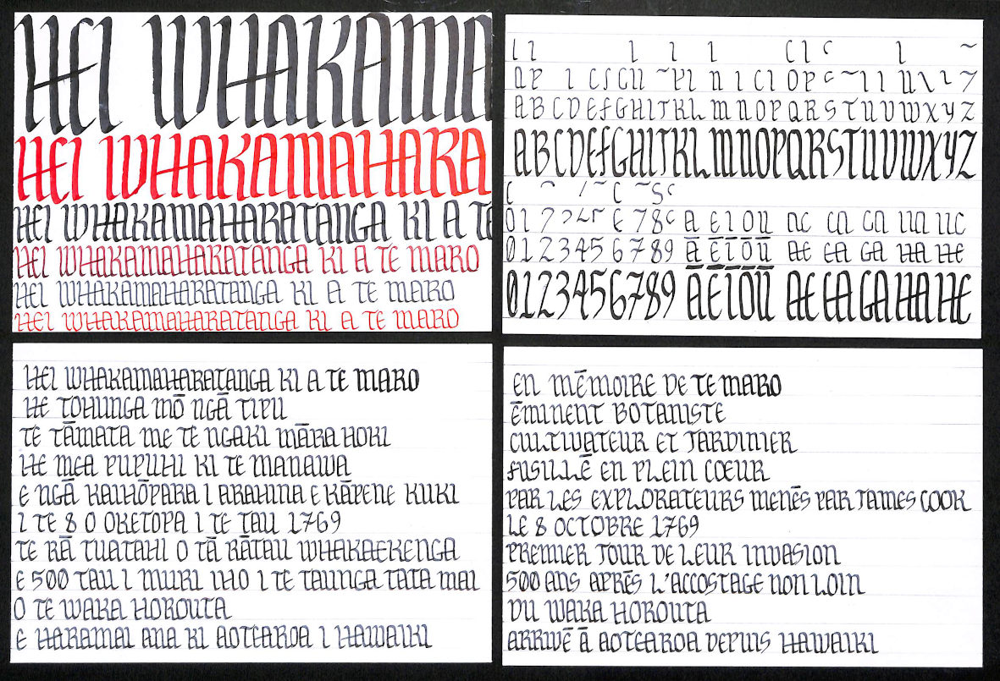

# Numéro 1

Semaine du 25 mars au 1er avril 2020

## En construction

Inconsolables depuis la fermeture de notre librairie de Compiègne, nous avons décidé de prendre les choses en main et de construire notre [librairie à la maison](https://www.lego.com/fr-fr/product/bookshop-10270). Evidemment, ce n'est pas la même chose, les livres de cette librairie sont un peu courts, mais ça nous aide à patienter.

## C'est dans la boîte

Pour nourrir les recherches des générations futures, nous stockons dans une boîte d'archive les documents liés au confinement : les journaux que nous ne lisons plus (trop déprimant), les [autorisations de sortie](https://www.gouvernement.fr/sites/default/files/cfiles/attestation-deplacement-fr-20200324.pdf) remplies à la main, les courriers électoraux et publicitaires reçus pendant cette période. Quand nos petits-enfants nous demanderons : c'était long la quarantaine ? Nous pourrons leur répondre : oh, une dizaine d'années, tout au plus.

## In Memoriam

Le 8 octobre 1769, James Cook découvrait la Nouvelle-Zélande et les Māori qui habitaient là depuis 500 ans découvraient les fusils des européens. Le 250ème anniversaire de ces événements est l'occasion d'évoquer la mémoire de Te Maro, éminent botaniste, cultivateur et jardinier, fusillé en plein cœur par les explorateurs menés par James Cook, le premier jour de leur invasion. Le style calligraphique In Memoriam a été créé spécialement pour ce texte commémoratif. Inspiré de l'une des seules polices de caractères Māori, [Whakarare](https://www.johnsonwitehira.studio/whakarare), il reprend des caractéristiques des caractères du moyen-âge gothiques pour donner au texte une texture très dense. Il évoque ainsi l'oppression subie par les Māori. L'absence de distinction de majuscules et de minuscules, à la manière des inscriptions gravées, lui confère un caractère solennel.

## De quelle couleur est cette maison rouge ?

## Police urbaine

