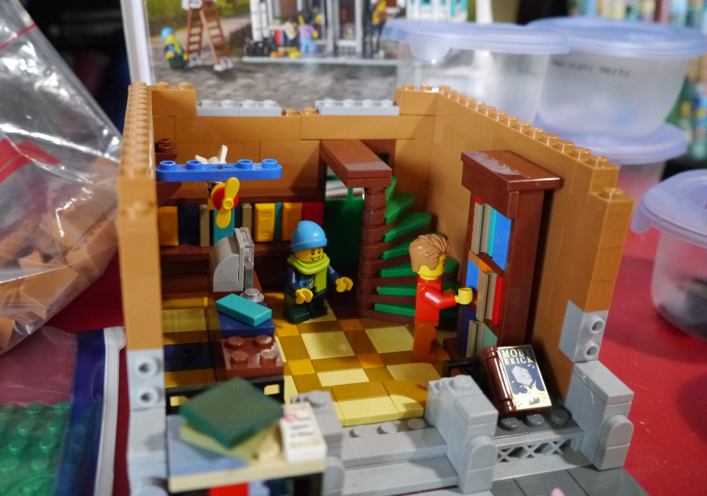
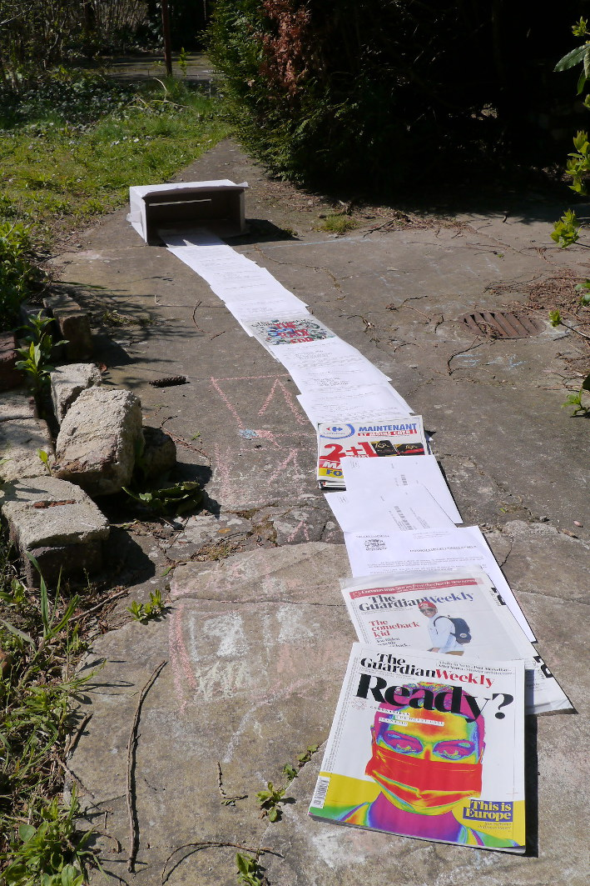

# Numéro 1

Semaine du 25 mars au 1er avril 2020

## En construction

Inconsolables depuis la fermeture de notre [librairie de Compiègne][SIGNES],
nous avons décidé de prendre les choses en main et de construire
notre [librairie à la maison][LEGO10270]. Evidemment, ce n'est pas
la même chose, les livres de cette librairie sont un peu courts,
mais ça nous aide à patienter.

[SIGNES]: http://www.librairiedessignes.com/
[LEGO10270]: https://www.lego.com/fr-fr/product/bookshop-10270

## C'est dans la boîte

Pour nourrir les recherches des générations futures, nous stockons
dans une boîte d'archive les documents liés au confinement :
les journaux que nous ne lisons plus (trop déprimant),
les [autorisations de sortie][autorisation] remplies à la main,
les courriers électoraux et publicitaires reçus pendant cette période.
Quand nos petits-enfants nous demanderons : c'était long la quarantaine ?
Nous pourrons leur répondre : oh, une dizaine d'années, tout au plus.

[autorisation]: https://www.gouvernement.fr/sites/default/files/cfiles/attestation-deplacement-fr-20200324.pdf

## In Memoriam

Le 8 octobre 1769, James Cook découvrait la Nouvelle-Zélande et les Māori
qui habitaient là depuis 500 ans découvraient les fusils des européens.
Le 250ème anniversaire de ces événements est l'occasion d'évoquer
la mémoire de Te Maro, éminent botaniste, cultivateur et jardinier, fusillé
en plein cœur par les explorateurs menés par James Cook, le premier jour de
leur invasion. Le style calligraphique In Memoriam a été créé spécialement
pour ce texte commémoratif. Inspiré de l'une des seules polices de caractères
Māori, [Whakarare][], il reprend des caractéristiques des caractères du
moyen-âge gothiques pour donner au texte une texture très dense. Il évoque
ainsi l'oppression subie par les Māori. L'absence de distinction de majuscules
et de minuscules, à la manière des inscriptions gravées, lui confère un
caractère solennel.

[Whakarare]: https://www.johnsonwitehira.studio/whakarare

## De quelle couleur est cette maison rouge ?

Le système d'organisation des couleurs NCS ([Natural Color System][NCS]),
normalisé en Suède depuis 1979, décrit un modèle pour caractériser les
couleurs que nous percevons, et nous fournit une méthode pour les identifier.
Tout d'abord, sélectionner la teinte, dans le cercle des couleurs :
s'agit-il d'une couleur à dominante jaune ou bleue, rouge ou verte ?
Ce sont les quatre points cardinaux du cercle. Ou bien d'une couleur neutre
à dominante blanche ou noire ? Elles sont à part, au centre du cercle.
On peut affiner la teinte en identifiant le pourcentage perçu de la couleur
secondaire, du jaune au rouge, du rouge au bleu, du bleu au vert, et du
vert au jaune. Il s'agit de couleurs perçues, et non de mélanges de lumières
ou de pigments colorés. Une fois la teinte choisie, on peut identifier sa
nuance dans le triangle des couleurs. Sur ce triangle, la chromaticité de
la couleur augmente de gauche à droite, du gris neutre aux couleurs pures,
par pallier de 10%. De haut en bas, les nuances varient du blanc au noir,
également par pallier de 10%. Chaque couleur perçue est identifiée de manière
unique par ses deux positions sur le cercle et dans le triangle des couleurs.

[NCS]: https://ncscolour.com/

## Police urbaine

Pour les super fans de typographie, ceux qui ont déjà vu deux fois le
documentaire [Helvetica][] avec tous les bonus, et même une fois de plus
pour gagner la [certification Helvetica][LEARNING_HELVETICA] sur leur profil
LinkedIn, il reste encore des heures et des heures de conversation à découvrir
retranscrites patiemment dans cet ouvrage publié en 2015.
[Helvetica/Objectified/Urbanized: The Complete Interviews][INTERVIEW_BOOK]
contient en fait trois livres, pour chacun des trois films de la trilogie de
Gary Hustwit sur le design : [Helvetica][] (design des lettres d'imprimerie),
[Objectified][] (design des objets) et [Urbanized][] (design des villes).
Les 207 pages avec l'intégralité des 20 entretiens de Helvetica justifient
déjà l'achat de cet ouvrage, d'autant plus qu'il est maintenant soldé à
moitié prix. A noter : Gary Hustwit diffuse actuellement
[un documentaire gratuitement chaque semaine][FREE_STREAMING],
ce qui vous donnera l'occasion de découvrir Urbanized d'ici le 7 avril.

[Helvetica]: https://www.hustwit.com/helvetica/
[Objectified]: https://www.hustwit.com/objectified
[Urbanized]: https://www.hustwit.com/urbanized

[LEARNING_HELVETICA]: https://www.linkedin.com/learning/helvetica
[INTERVIEW_BOOK]: https://www.hustwit.com/interviewsbook
[FREE_STREAMING]: https://www.ohyouprettythings.com/free
