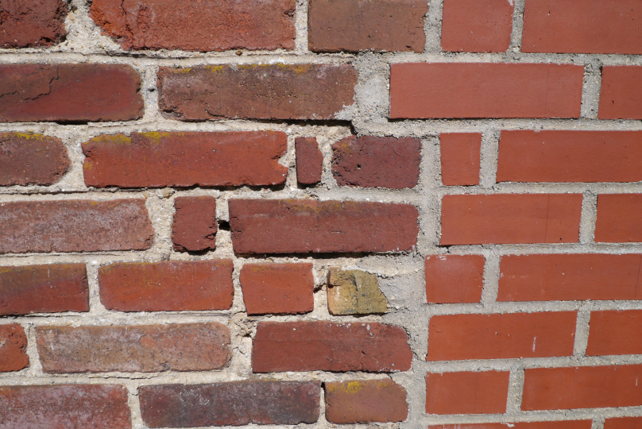

# Numéro 3

Semaine du 8 avril au 15 avril 2020

## Mémoires d'un tsundoku

Combien de livres me reste-t-il à lire ?
Il faut bien tout compter.
Les livres rangés sur les étagères.
Ceux posés ici et là, à peine entamés.
Les livres que je lis en ce moment.
Ah, les livres électroniques aussi, achetés ou téléchargés gratuitement.
Et puis les magazines hors-série épais et compliqués.
J'additionne tout ça...
Si votre total est supérieur à votre âge,
alors vous êtes peut-être un tsundoku.
Dans mon cas, aucun doute possible : plus de quatre fois mon âge.
C'était il y a une dizaine d'années.

Comme le sudoku, le mot [tsundoku][] nous vient du Japon.
Il signifie empiler les livres plus vite qu'on ne les lit.
Le mot est japonais, mais le concept nous est très familier.
Si vous achetez 4 livres par mois et que vous n'en lisez qu'un,
vous êtes un tsundoku.

Il s'agit d'une addiction qui ne fait trop de mal à personne,
si ce n'est à votre dos. Et leur accumulation peut devenir
oppressante et... vous décourager de les lire. Aussi, voici
quelques astuces pour vous aider à réduire votre [PAL][] (Pile À Lire).

Faites une liste exhaustive, avec les titres et les nombres de pages.
Triez là par catégorie. Choisissez un ordre de lecture.

Si vous avez plus de 100 livres à lire, arrêtez complètement d'en acheter.
En cherchant bien, vous êtes même peut-être déjà à 150 ou 200.
Fixez vous des objectifs de pallier à atteindre d'ici une certaine date,
par exemple moins de 100 livres restant dans un an, et commencez la descente.

Lisez un peu tous les jours. Si le livre est compliqué, un chapitre à la fois.
Pour varier les plaisirs, lisez un, deux ou trois livres en parallèle.

Pour visualiser votre progression, mettez un calendrier sur le mur.
Pour chaque livre en cours, tracez jour après jour une ligne de métro.
A chaque chapitre terminé, ajoutez une station.
Au terminus, notez le nombre de livres restant.

Une fois un pallier dépassé, vous pouvez vous autoriser quelques achats,
pour vous récompenser, sous réserve de ne pas remonter au-dessus du pallier.
Mais avant d'acheter un nouveau livre, réfléchissez-y à deux fois,
et finissez d'abord ceux que vous avez déjà sur le même sujet.

S'il y a un risque qu'un livre rare ou introuvable disparaisse à jamais,
achetez-le aujourd'hui. Mais mettez-le dans une boîte pour plus tard,
pour vous le faire offrir. Et ne laissez pas la boîte déborder.

Dix ans plus tard, vous êtes maintenant un tsundoku complètement réformé.
Vous pouvez parfois vous permettre d'acheter un ou deux livres non prévus,
en gardant l'œil sur le compteur. Ou mieux, achetez-les pour offrir.

[tsundoku]: https://en.wikipedia.org/wiki/Tsundoku
[PAL]: https://www.huffingtonpost.fr/2017/10/14/ce-que-signifie-votre-pal-votre-pile-a-lire-qui-sagrandit-de-jour-en-jour_a_23223392/

## Créez vos propres règles

Comment obtenir une règle de 60cm ?
En combinant deux [règles Lego de 30cm][LEGO_RULER], bien sûr.
Rien de bien compliqué à première vue.
Il suffit de doubler les proportions, à peu de choses près,
et d'adapter les instructions pour attacher les deux règles au milieu.
En y regardant de plus près, toutefois,
quelques détails méritent qu'on s'y arrête.

Les deux règles séparées sont graduées de 0 à 30cm. A défaut de pouvoir
mesurer de 30 jusqu'à 60cm, on peut placer chaque 0 à une extrémité de
la règle pour pouvoir mesurer depuis les deux côtés de la feuille. Soit.

Il est plus difficile de tracer un trait horizontal de 60cm que de 30cm.
Une légère erreur d'alignement, un dixième de degré,
décale le trait d'un demi-millimètre seulement à 30cm.
mais cet écart double avec la distance pour atteindre 1mm à 60cm.
Pour aggraver les choses, la règle de 60cm est plus difficile à conserver
droite pendant que l'on trace le trait. Il faut l'appuyer plus fermement.
Ajoutons une poignée au milieu de la règle, pour mieux la garder en place.

Le même problème d'angle s'applique à la torsion de la règle lorsqu'on
la soulève. La règle de 30cm est assez rigide, mais avec la même épaisseur,
la règle de 60cm subit une déformation deux fois supérieure. Ceci nécessite de
revoir la conception en profondeur, et d'ajouter une fine couche de Lego.
Je recommande un assortiment de plaques de 4x8, 4x6 et 4x4.
On obtient ainsi une règle de 60cm plus rigide,
un peu plus lourde et plus stable.

Règle à construire Lego 5005107, 28 pièces.

[LEGO_RULER]: https://www.lego.com/fr-fr/product/lego-buildable-ruler-5005107

## Direction émotions

Dans sa bande dessinée [Emotions : Enquête et mode d’emploi][EMOTIONS],
la dessinatrice Art-mella nous présente
une [boussole des émotions][BOUSSOLE] avec [4 directions][4DIRECTIONS].
Au nord, le plaisir et la joie nous indiquent la direction pour avancer.
À l'opposé, la peur est un mouvement de recul, qui nous ralentit.
À l'ouest, la colère rejette et repousse d'un grand mouvement vers l'extérieur.
À l'est, la tristesse tombe vers le bas, et nous fait glisser vers l'intérieur.

Ces quatre directions peuvent s'avérer utile pour représenter graphiquement
nos émotions. Voilà une belle source d'inspiration que cette bande dessinée.

[EMOTIONS]: http://conscience-quantique.com/category/bd/emotions/
[BOUSSOLE]: https://conscience-quantique.com/extrait-4-la-boussole-des-emotions/
[4DIRECTIONS]: https://conscience-quantique.com/extrait-3-les-4-directions-des-emotions/

## NCS S 5030-Y80R

Dans la classification NCS ([Natural Color System][NCS]),
ce code correspond à l'une des couleurs des briques de ce mur.
De quelle couleur s'agit-il ?

Lorsqu'on évalue une couleur dans le système NCS, on répartit un total
de 100 points entre la quantité de noir, de blanc et de couleur perçus.

Les deux premiers chiffres du code indiquent le pourcentage de noir.
Avec 50% de noir, c'est une couleur sombre où l'impression de noir domine
sur l'impression de blanc et de couleur.

Les deux chiffres suivants indiquent le pourcentage de couleur.
Le pourcentage de blanc n'est pas indiqué, c'est le complément à 100.
Avec 30% de chromaticité, et donc 20% de blanc, l'impression de couleur domine
sur l'impression de gris. C'est une couleur sombre mais relativement vive.

Le groupe suivant commence et finit par deux lettres
qui indiquent le quadrant de la teinte dans le cercle des couleurs,
ici le quadrant qui va du jaune (Y pour Yellow) au rouge (R pour Red).

Pour évaluer la teinte, on répartit 100 points
entre la couleur de départ et la couleur d'arrivée du quadrant.
On donne deux chiffres pour le pourcentage de la couleur d'arrivée ;
le pourcentage de la couleur de départ est omis, c'est le complément à 100.
Avec 80% de rouge pour 20% de jaune, cette couleur est très proche du rouge,
un rouge légèrement orangé.

En somme, il s'agit d'un rouge brique vif mais sombre.
[L'avez-vous trouvé][SOLUTION] ?

[NCS]: https://ncscolour.com/
[SOLUTION]: http://46.16.232.131/share/ubqvk

## Va voir avec Vincent

Le film [At Eternity's Gate][MOVIE] (À la porte de l'éternité),
diffusé en France par [Netflix][NETFLIX],
est une invitation à suivre Vincent Van Gogh pendant les dernières années
de sa vie et à partager sa perspective unique sur le monde.

Ce n'est pas une biographie du peintre.
C'est un voyage magique dans l'univers de Vincent Van Gogh.

Les événements présentés sont basés sur des lettres, des témoignages,
mais aussi des hypothèses romancées, sur la mort accidentelle du peintre,
ou un carnet perdu qui aurait été retrouvé en 2016,
en fait connu précédemment et [non authentifié][NOT_VAN_GOGH].

Il s'agit d'un film lent où l'action cède le pas à l'impression.
Nous marchons dans les pas du peintre sur les chemins de campagne,
nous goûtons la terre et le soleil, nous sentons le vent.
La caméra portée à l'épaule nous entraîne à sa suite et nous fait
partager le rythme de ses mouvements.
La caméra bascule pour suivre son regard. Nous voyons ce qu'il voit,
nous suivons ses gestes lorsqu'il peint ou qu'il dessine en pleine nature.
L'image se floute et se colore, et nous fait partager sa confusion.

Les tournesols sont là. Les modèles aussi. De belles rencontres, douces avec
son frère Théo, tumultueuses avec Paul Gauguin, jusqu'aux médecins de l'asile,
sont l'occasion de partager les réflexions philosophiques de Vincent Van Gogh.
Fils de pasteur, il avait contemplé devenir pasteur lui-même et avait
étudié la théologie. Ses peintures, que ses contemporains jugent moches,
sont un témoignage de la beauté du monde pour les générations futures.

[MOVIE]: https://www.ateternitysgate-film.com/
[NETFLIX]: https://www.netflix.com/watch/81020388
[NOT_VAN_GOGH]: https://www.vangoghmuseum.nl/en/news-and-press/press-releases/found-sketchbook-with-drawings-is-not-by-van-gogh-according-to-van-gogh-museum

