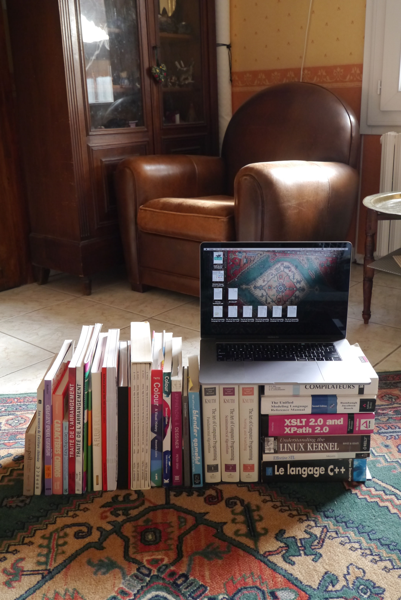
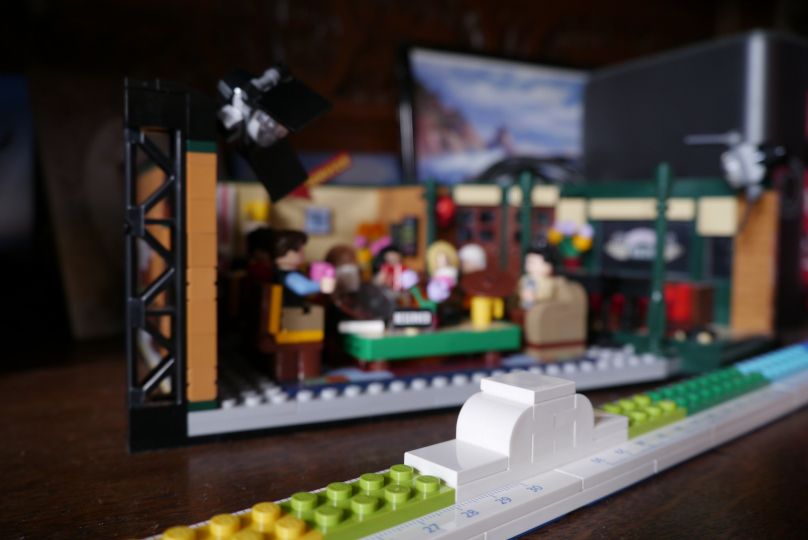

# Numéro 3

Semaine du 8 avril au 15 avril 2020

## Mémoires d'un tsundoku

Combien de livres me reste-t-il à lire ?
Il faut bien tout compter.
Les livres rangés sur les étagères.
Ceux posés ici et là, à peine entamés.
Les livres que je lis en ce moment.
Ah, les livres électroniques aussi, achetés ou téléchargés gratuitement.
Et puis les magazines hors-série épais et compliqués.
J'additionne tout ça...
Si votre total est supérieur à votre âge,
alors vous êtes peut-être un tsundoku.
Dans mon cas, aucun doute possible : plus de quatre fois mon âge.
C'était il y a une dizaine d'années.

Comme le sudoku, le mot [tsundoku][] nous vient du Japon.
Il signifie empiler les livres plus vite qu'on ne les lit.
Le mot est japonais, mais le concept nous est très familier.
Si vous achetez 4 livres par mois et que vous n'en lisez qu'un,
vous êtes un tsundoku.

Il s'agit d'une addiction qui ne fait trop de mal à personne,
si ce n'est à votre dos. Et leur accumulation peut devenir
oppressante et... vous décourager de les lire. Aussi, voici
quelques astuces pour vous aider à réduire votre [PAL][] (Pile À Lire).

Faites une liste exhaustive, avec les titres et les nombres de pages.
Triez là par catégorie. Choisissez un ordre de lecture.

Si vous avez plus de 100 livres à lire, arrêtez complètement d'en acheter.
En cherchant bien, vous êtes même peut-être déjà à 150 ou 200.
Fixez vous des objectifs de pallier à atteindre d'ici une certaine date,
par exemple moins de 100 livres restant dans un an, et commencez la descente.

Lisez un peu tous les jours. Si le livre est compliqué, un chapitre à la fois.
Pour varier les plaisirs, lisez un, deux ou trois livres en parallèle.

Pour visualiser votre progression, mettez un calendrier sur le mur.
Pour chaque ligne en cours, tracez jour après jour une ligne de métro.
A chaque chapitre terminé, ajoutez une station.
Au terminus, notez le nombre de livres restant.

Une fois un pallier dépassé, vous pouvez vous autoriser quelques achats,
pour vous récompenser, sous réserve de ne pas remonter au-dessus du pallier.
Mais avant d'acheter un nouveau livre, réfléchissez-y à deux fois,
et finissez d'abord ceux que vous avez déjà sur le même sujet.

S'il y a un risque qu'un livre rare ou introuvable disparaisse à jamais,
achetez-le aujourd'hui. Mais mettez-le dans une boîte pour plus tard,
pour vous le faire offrir. Et ne laissez pas la boîte déborder.

Dix ans plus tard, vous êtes maintenant un tsundoku complètement réformé.
Vous pouvez parfois vous permettre d'acheter un ou deux livres non prévus,
en gardant l'œil sur le compteur. Ou mieux, achetez-les pour offrir.

[tsundoku]: https://en.wikipedia.org/wiki/Tsundoku
[PAL]: https://www.huffingtonpost.fr/2017/10/14/ce-que-signifie-votre-pal-votre-pile-a-lire-qui-sagrandit-de-jour-en-jour_a_23223392/

## Créez vos propres règles

Comment obtenir une règle de 60cm ?
En combinant deux [règles Lego de 30cm][LEGO_RULER], bien sûr.
Rien de bien compliqué à première vue.
Il suffit de doubler les proportions, à peu de choses près,
et d'adapter les instructions pour attacher les deux règles au milieu.
En y regardant de plus près, toutefois,
quelques détails méritent qu'on s'y arrête.

Les deux règles séparées sont graduées de 0 à 30cm. A défaut de pouvoir
mesurer de 30 jusqu'à 60cm, on peut placer chaque 0 à une extrémité de
la règle pour pouvoir mesurer depuis les deux côtés de la feuille. Soit.

Il est plus difficile de tracer un trait horizontal de 60cm que de 30cm.
Une légère erreur d'alignement, un dixième de degré,
décale le trait d'un demi-millimètre seulement à 30cm.
mais cet écart double avec la distance pour atteindre 1mm à 60cm.
Pour aggraver les choses, la règle de 60cm est plus difficile à conserver
droite pendant que l'on trace le trait. Il faut l'appuyer plus fermement.
Ajoutons une poignée au milieu de la règle, pour mieux la garder en place.

Le même problème d'angle s'applique à la torsion de la règle lorsqu'on
la soulève. La règle de 30cm est assez rigide, mais avec la même épaisseur,
la règle de 60cm subit une déformation deux fois supérieure. Ceci nécessite de
revoir la conception en profondeur, et d'ajouter une fine couche de Lego.
Je recommande un assortiment de plaques de 4x8, 4x6 et 4x4.
On obtient ainsi une règle plus rigide, un peu plus lourde et plus stable.

Règle à construire Lego 5005107, 28 pièces.

[LEGO_RULER]: https://www.lego.com/fr-fr/product/lego-buildable-ruler-5005107

## Direction émotion

## NCS S ####-X##X

## Va voir avec Vincent

