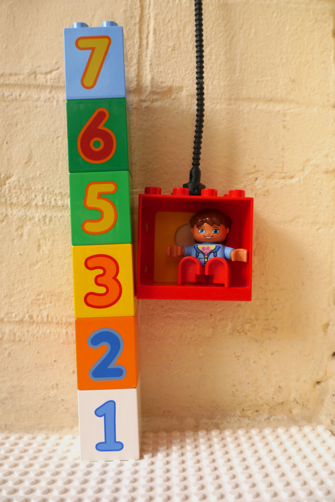
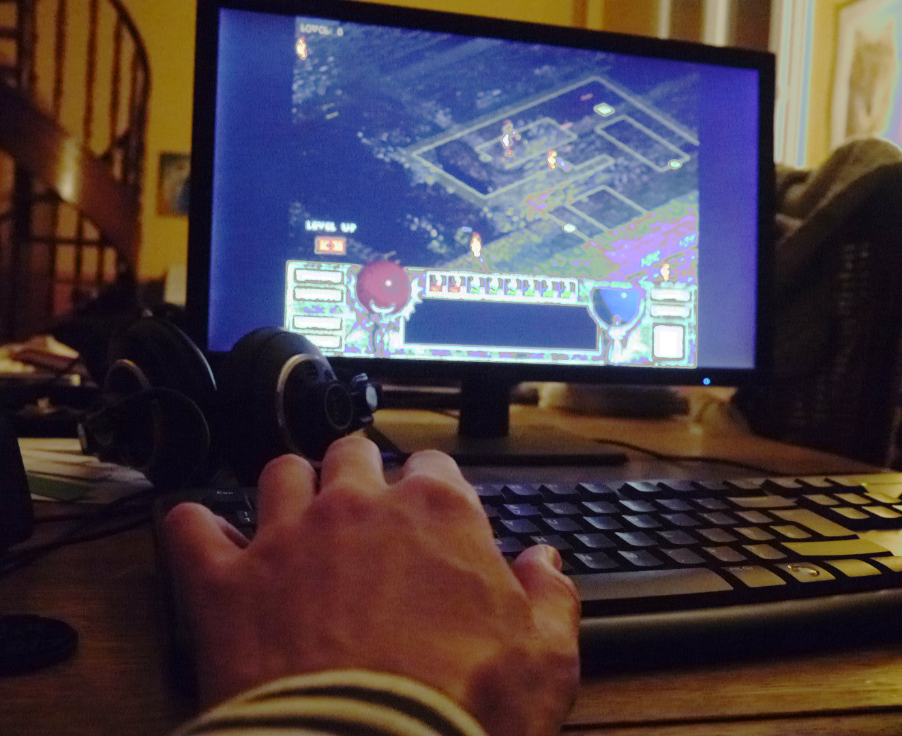
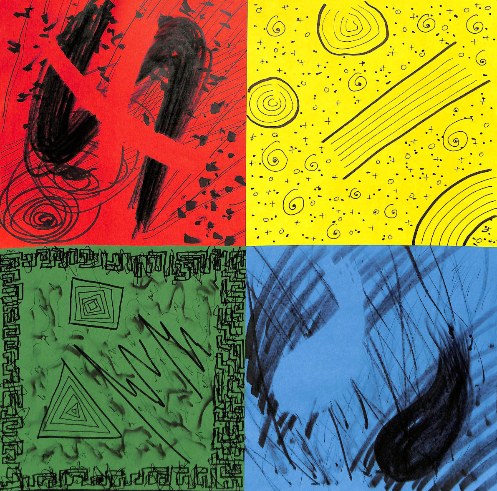
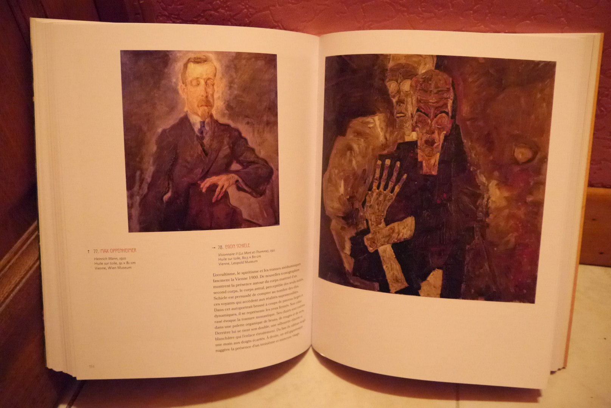

# Numéro 4

Semaine du 15 avril au 22 avril 2020

## Le Quatre est mort ! Vive le Cinq !

La sortie de ce numéro 4 est l'occasion d'évoquer un souvenir du Japon.
Je séjournais pour une semaine dans un hôtel du quartier d'affaires
de Shinagawa, au sud de Tokyo. Cet hôtel est construit dans une tour
très haute, à l'image des nombreuses tours de ce quartier moderne.
Même pour quelqu'un qui préfère emprunter les escaliers,
l'ascenseur est ici un passage obligé. Et passage après passage,
de la réception vers la chambre et de la chambre vers la réception,
cet ascenseur illustrait deux faits étranges de la culture du Japon.

Le plus évident à remarquer :
la réception de l'hôtel se trouve au premier étage.
On peut arriver à l'hôtel en voiture, un niveau plus bas.
Mais ce n'est pas ça. Ce niveau inférieur est le −1.
L'étage numéro 1 est notre rez-de-chaussée.

On compte ainsi, à partir du sol, 1, 2, 3, 5, 6, 7.
Serait-ce un effet du décalage horaire ?
Cet ascenseur ne s'arrête jamais au 4e étage.
Ni en montant, ni en descendant.
Est-ce un étage réservé au service, accessible par un autre ascenseur ?
Non. Le temps de parcours de l'ascenseur en montant du 3e
au 5e, et en descendant du 5e au 3e,
est identique au temps pour monter ou descendre d'un seul étage.

Cet hôtel n'a pas de quatrième étage. C'est un problème courant en Asie.
En japonais comme en chinois, le mot quatre sonne comme la mort.
C'est un peu comme si nous comptions : un, deux, trois, mort, cinq.
Ceci résulte en [une peur associée au chiffre 4][4PHOBIA],
similaire à la peur associée chez nous au chiffre 13.
L'apparition d'un ou plusieurs chiffres 4 est un signe de mauvais augure.
On évite le chiffre 4 dans les immeubles, les rues, les numéros de téléphone.
Et le 4 avril est le jour le plus funeste de l'année.

[4PHOBIA]: https://en.wikipedia.org/wiki/Tetraphobia

## La mémoire dans la peau

La [visualisation][] est une technique utilisée par les athlètes
de haut niveau, qui consiste à s'imaginer en train de réaliser une séquence
de mouvements pour activer les circuits nerveux associés et la mémoriser.
Il s'agit d'une forme de mémoire non verbale et implicite,
en quelque sorte une mémoire des muscles, qui permet ensuite
de réaliser cette action sans y réfléchir consciemment.

Je suis loin, pour ma part, d'être un sportif de haut niveau.
J'ai pourtant pu faire récemment une expérience similaire.
Le site [GOG.com][] a été fondé en 2008 pour vendre sur Internet
de « bons vieux jeux vidéos », “Good Old Games”,
reformatés pour les rendre compatibles avec les ordinateurs actuels.
Il sort ainsi chaque année de nouveaux jeux des années 1990 et 2000.

En jouant cette semaine au même jeu à vingt ans d'intervalle,
j'ai retrouvé de manière inconsciente des gestes de la main
adaptés et efficaces en réaction aux circonstances du jeu.
C'est un sentiment étrange que de retrouver un geste oublié,
comme remettre une vieille paire de chaussures
et s'étonner de la trouver encore confortable.

[visualisation]: https://www.jonathanlelievre.com/fr/blogue/preparation-mentale-du-sportif-visualisation-dans-les-details-21
[GOG.com]: https://www.gog.com/

## Elles se tracent, elles se cassent

Les quatre émotions de base, la colère, la joie, la peur, la tristesse,
sont aisément associées avec des couleurs qui leur correspondent.
On dit bien être rouge de colère, vert de peur.
Avoir un coup de blues, prenons un bleu nuit pour la tristesse.
Et à l'inverse, un jaune lumineux pour la joie.

Il est moins aisé de trouver des traits, tracés au feutre noir,
qui soient caractéristiques de ces émotions.

La colère se ferme comme une croix qui interdit le passage.
Elle passe et repasse en traits rapprochés et nerveux, comme une discussion
où le ton monte et l'espace se réduit à force de répéter les mêmes arguments.
Puis elle explose et laisse derrière elle de petits fragments tranchants.

La joie nous transporte dans un univers radieux, calme, serein.
Un espace de jeu aux formes douces et ouvertes,
qui nous conduit sans nous commander.
Les bons points et les petits plus renforcent notre bonne humeur.

La tristesse tombe et ruisselle telle la pluie sur la fenêtre.
De grosses gouttes y nagent comme des poissons dans l'eau salée des larmes.
Un filet d'algues noires les retiennent.

La peur n'avance qu'à reculons. Elle craint de s'éloigner des bords,
tremble, rebrousse chemin. Lit les signes de travers, qu'elle prend
pour des avertissements. Et se perd dans la brume d'un feutre usé.

[4DIRECTIONS]: https://conscience-quantique.com/extrait-3-les-4-directions-des-emotions/
[EMOTIONS]: http://conscience-quantique.com/category/bd/emotions/

## Le peintre marteau

## Peinture voyante

