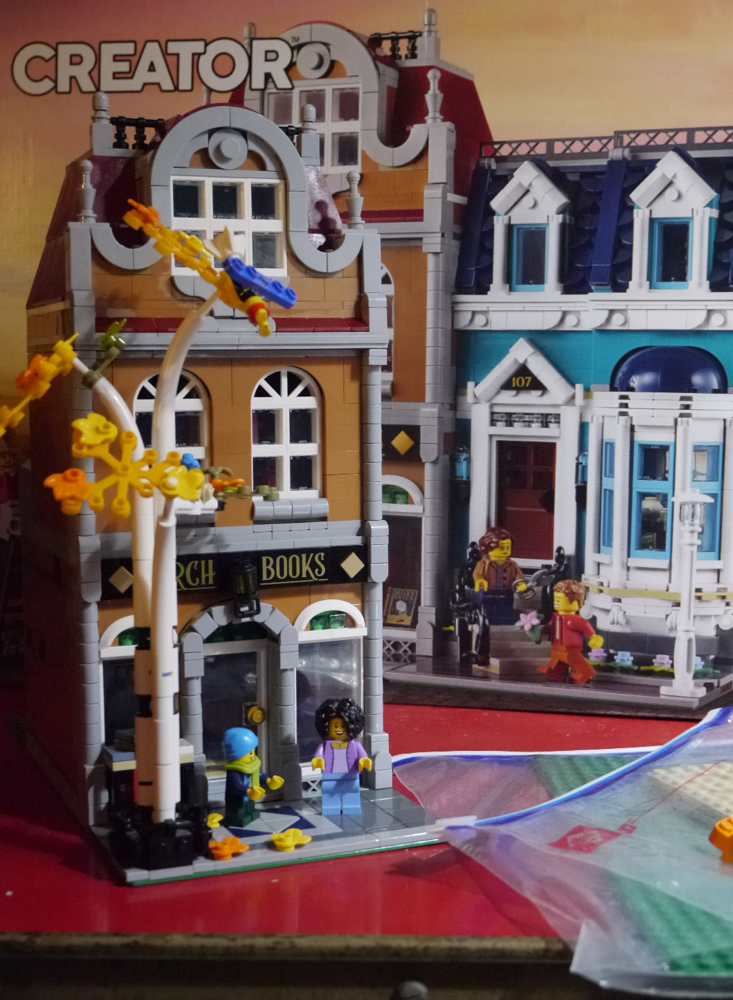
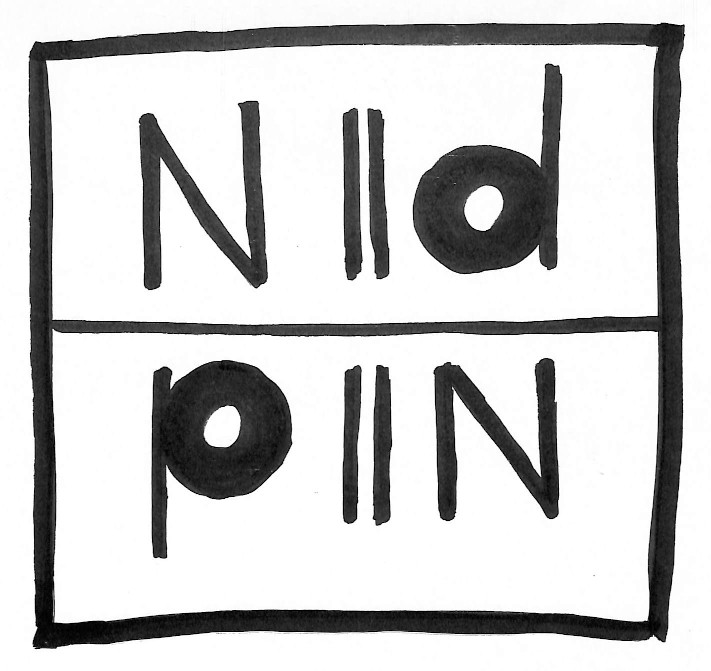
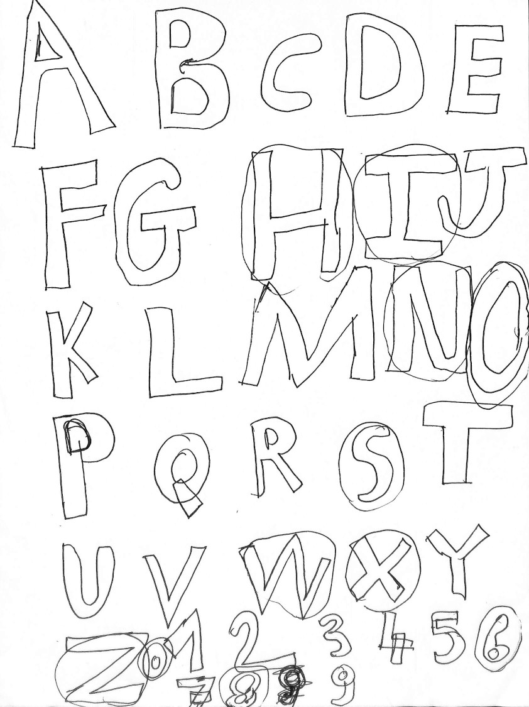
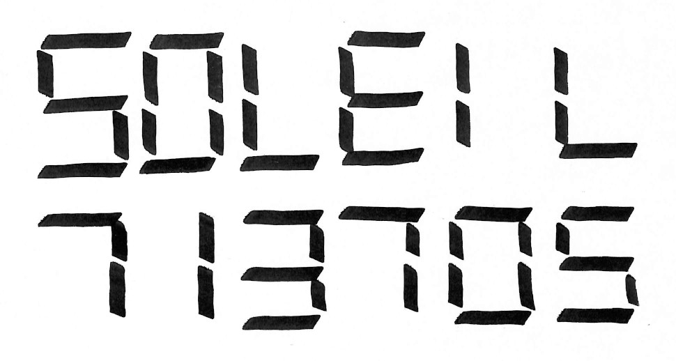
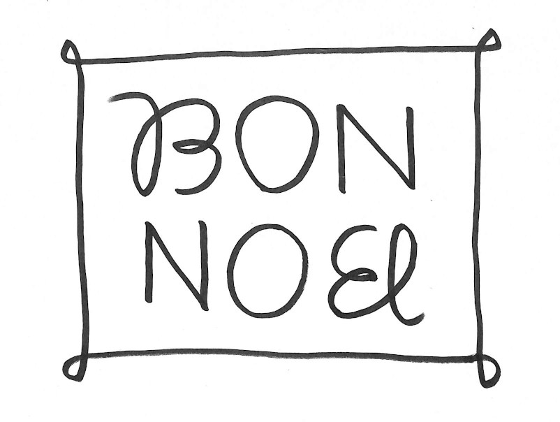
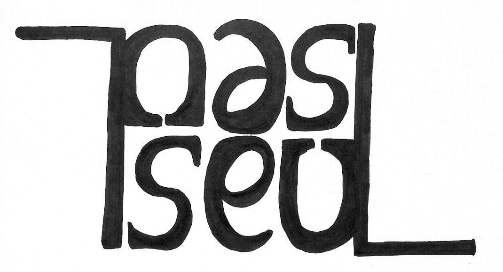
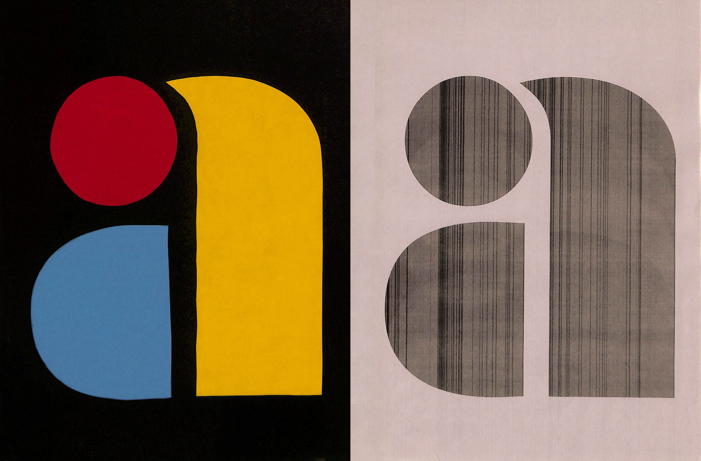
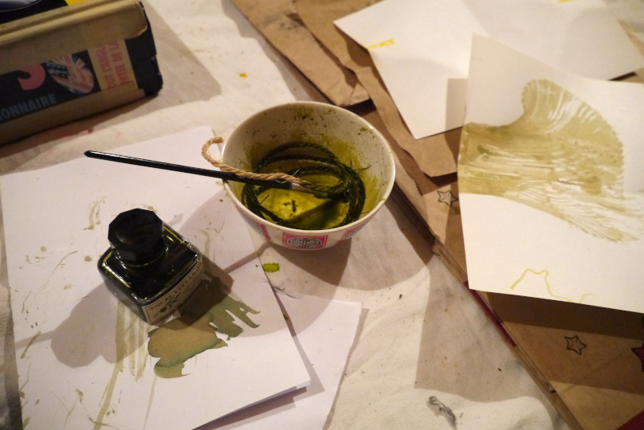
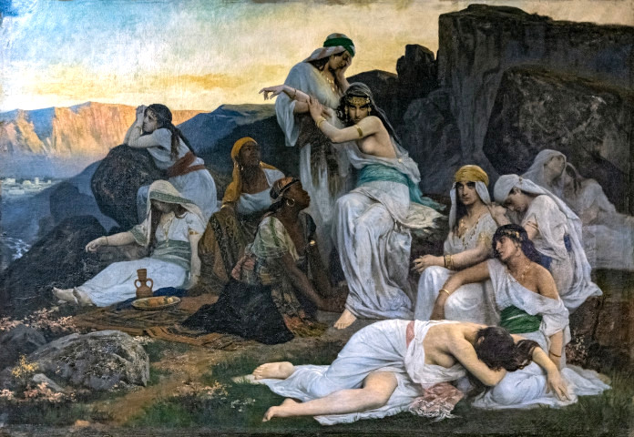

# Numéro 5

Semaine du 22 avril au 29 avril 2020

## Des livres et vous

Pour célébrer la fin de sa construction, la librairie Au Beau Boulot
organise une soirée d'inauguration sur le thème « Des livres et vous »
(Délivrez-vous).

L'entrée est libre mais une tenue de soirée est exigée.
Chaque personne est invitée à se présenter à travers
trois livres de son choix, portés ainsi :
un dans sa main, un sur sa tête et un sur son cœur.

Renseignements : au-bon-boulot@eric.brechemier.name

## Double sens

Un [ambigramme][] est un visuel ambigu
qui fait apparaître une nouvelle lecture
lorsqu'on le regarde à l'envers.

Par exemple, on peut créer ainsi un logo qui reste identique
lorsque l'on retourne la boîte ou le vêtement où il se trouve.

C'est le cas du logo de [New Man][], une marque française de prêt-à-porter,
dont le logo, conçu en 1969 par le graphiste-designer [Raymond Loewy][],
est toujours en usage aujourd'hui.

[ambigramme]: https://fr.wikipedia.org/wiki/Ambigramme
[New Man]: https://fr.wikipedia.org/wiki/New_Man
[Raymond Loewy]: https://fr.wikipedia.org/wiki/Raymond_Loewy

Pour créer un ambigramme,
commençons par écrire un alphabet, par exemple en lettre majuscules.
Ensuite, retournons la feuille.

Certaines lettres peuvent être lues
de la même manière dans les deux sens :
le H, le I, le N, le O, le S, le X, le Z.

D'autres lettres donnent une nouvelle lettre à l'envers :
le M devient un W, comme le 6 devient un 9, et le 3 ressemble à un E.

En variant le style d'écriture, on trouve d'autres transformations :
le u minuscule devient un n, le e ressemble à un a.
Le l minuscule se lit dans les deux sens,
mais il ressemble également à un i.

Nous jouions à ce jeu, étant enfants, sur nos calculatrices d'école.
Avec les chiffres qui donnent des lettres à l'envers,
nous cherchions à écrire le mot le plus long.

Une fois adulte, on peut changer les règles, modifier la forme des lettres,
ou les regrouper pour créer de nouvelles combinaisons inversées.

Si vous trouvez cet exercice mental un peu épuisant,
ne vous inquiétez pas, vous n'êtes pas seul.

## Je vous fais une lettre

## Le peintre au bout du fil

## Enterrement de vie de jeune fille

