# Numéro 6

Semaine du 29 avril au 6 mai 2020

## Déformations professionnelles

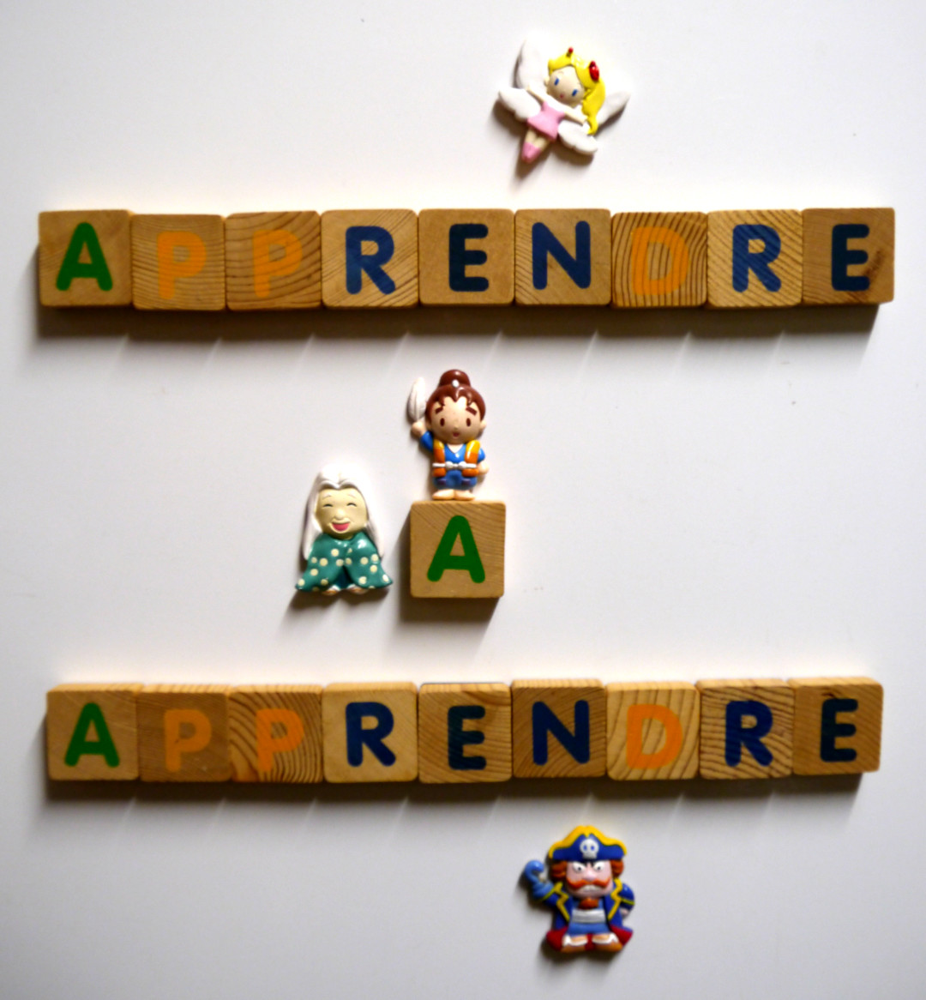

Enseigner est un métier, ça ne s'improvise pas.
Avant d'enseigner, il faut apprendre à enseigner.

Apprendre non plus, ça ne s'improvise pas.
Aussi, avant d'apprendre, il faut apprendre à apprendre.

Mais qui va nous enseigner à apprendre à apprendre ?
Un enseignant sachant enseigner comment apprendre à apprendre.

Dans le cas de la formation à distance, il y a un problème.
L'enseignant n'est pas présent
pour tenir la main de l'élève qui fait ses premiers pas.
Il doit donc réfléchir, de manière indirecte, à des interactions
qui permettront à l'apprenant de découvrir par lui-même
tout ce dont il a besoin pour progresser dans la formation.

C'est une analyse similaire à la création d'un jeu :
le créateur du jeu n'est pas présent avec les joueurs.
Il conçoit un système de règles
qui vont façonner de manière indirecte
l'expérience des joueurs au cours du jeu.
Même mieux, il existe aujourd'hui des jeux
auxquels on peut commencer à jouer sans lire les règles,
que l'on découvre progressivement en tirant des cartes
au fur et à mesure de la première partie.

## Le peintre réservé

Lorsqu'on peint avec des encres liquides,
il est difficile de préserver de petits espaces blancs.
L'encre blanche coûte cher, et n'est souvent que d'un faible secours.
Les couleurs s'additionnent par transparence et se mélangent sur la feuille.
Ainsi, pour avoir du blanc, il faut garder la page vierge
ou bien n'y ajouter que du blanc, et rien d'autre.

Pour réserver ces espaces blancs pendant qu'on peint,
qu'on verse, qu'on pulvérise de l'encre à cœur joie,
voici la technique la plus rapide, la plus pratique
et celle qui donne les meilleurs résultats.
Malheureusement, il s'agit de trois méthodes différentes.

### Le pastel gras

C'est la technique la plus rapide.
Le pastel gras file sur la feuille
comme le beurre sur la poêle,
et recouvre rapidement la zone à protéger.

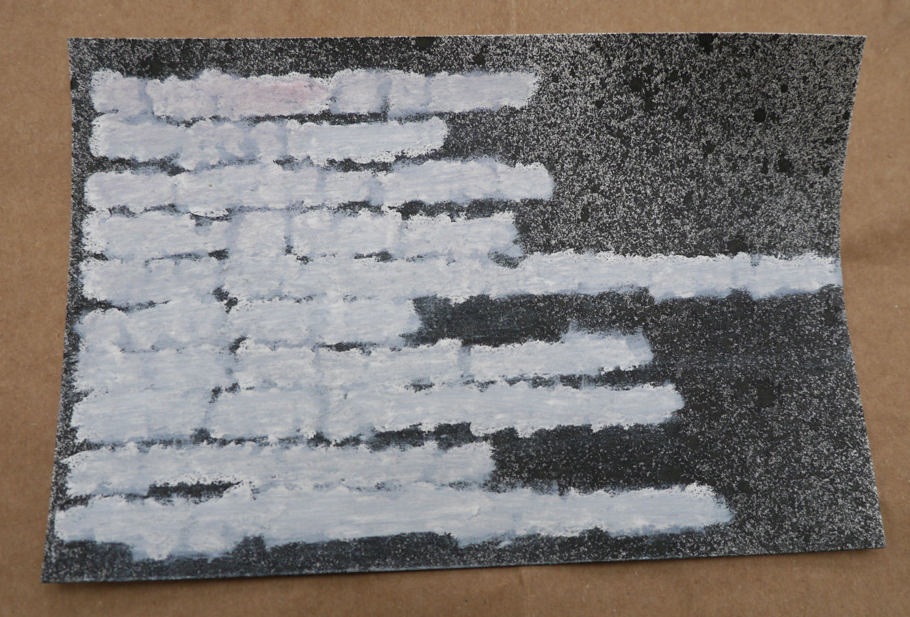

Après application, on peut peindre immédiatement sur toute la feuille.
Le gras du pastel repousse l'encre,
qui va coucher ailleurs.
C'est le même principe que la [lithographie][].

[lithographie]: https://fr.wikipedia.org/wiki/Lithographie#Principe

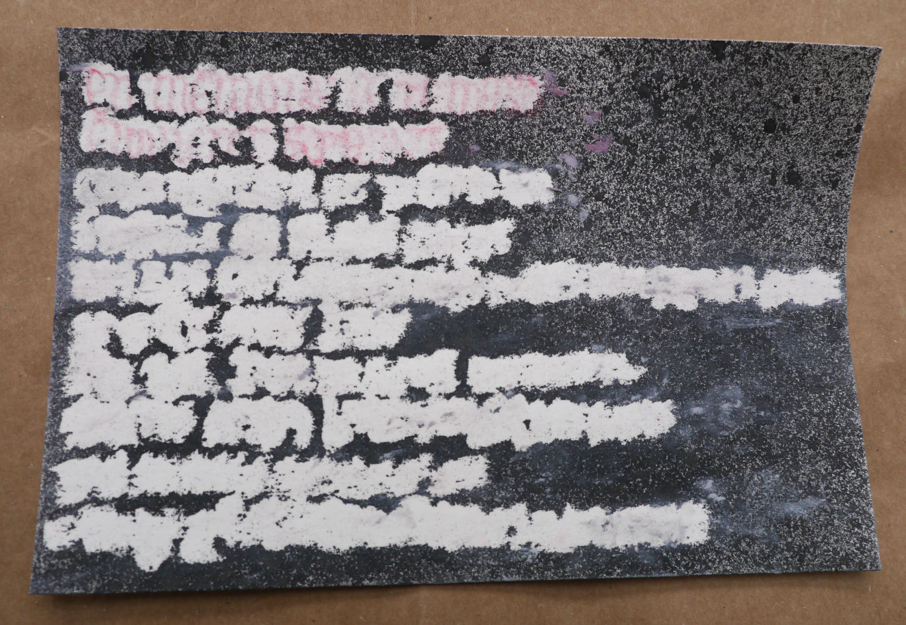

Avant d'utiliser la zone réservée, il faut bien la gommer
pour enlever le pastel. Sinon, l'encre est repoussée.

On peut ensuite peindre directement sur le papier préservé.
C'est comme si l'on avait fait un trou
dans la couche de peinture supérieure
pour arriver jusqu'au papier.

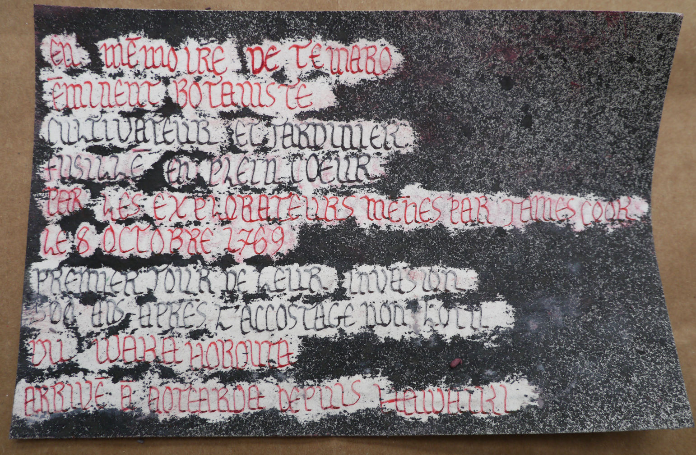

Malheureusement, le pastel n'est pas précis.
Il est difficile à tailler car il s'effrite en poussière.
Il est très fragile. Et il colle aux doigts.

### Les crayons pastels

C'est la technique la plus pratique. Les crayons pastels se taillent
et s'utilisent comme des crayons classiques. Ils sont très précis.

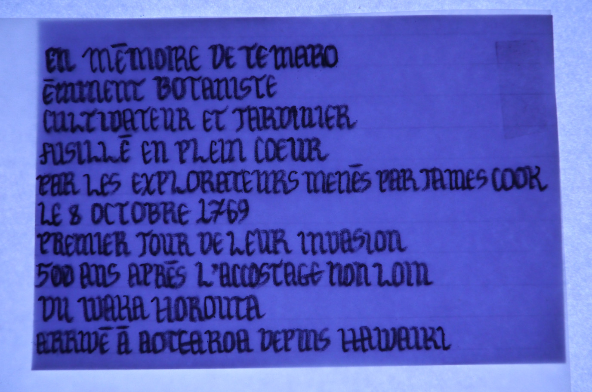

Malheureusement, en contrepartie, ils sont beaucoup moins couvrants
qu'un bâtonnet de pastel gras, et ils repoussent l'encre faiblement.

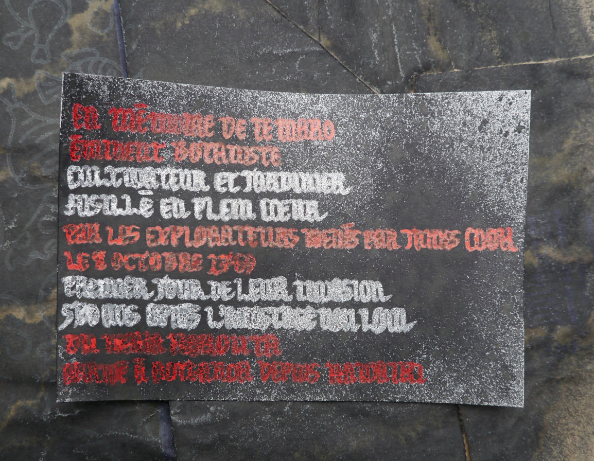

### Le fluide de masquage

C'est la technique la plus pénible, mais malheureusement
c'est celle qui donne les meilleurs résultats.

Le fluide de masquage est un liquide bleu à base de latex,
qui sèche à l'air libre pour former un film protecteur.
Il sent très mauvais, il est un peu toxique et irritant.
Son emploi requiert des précautions.

Il faut attendre 45 minutes pour qu'il sèche sur la feuille
avant de pouvoir peindre par-dessus. A l'inverse, il sèche rapidement
et s'accumule dans les poils des pinceaux et il est très difficile
de les récupérer.

Utilisé ici à la plume, on peut avoir un résultat assez précis.

J'ai utilisé un sèche-cheveux pendant quelques minutes
pour réduire le temps de séchage avant de peindre.

Il faut ensuite attendre que la peinture soit bien sèche
avant d'enlever le film protecteur. Appliqué en couche épaisse,
il se décolle facilement en frottant avec le doigt.
Mais il arrive parfois qu'il adhère un peu trop
et qu'il s'arrache en déchirant la feuille.

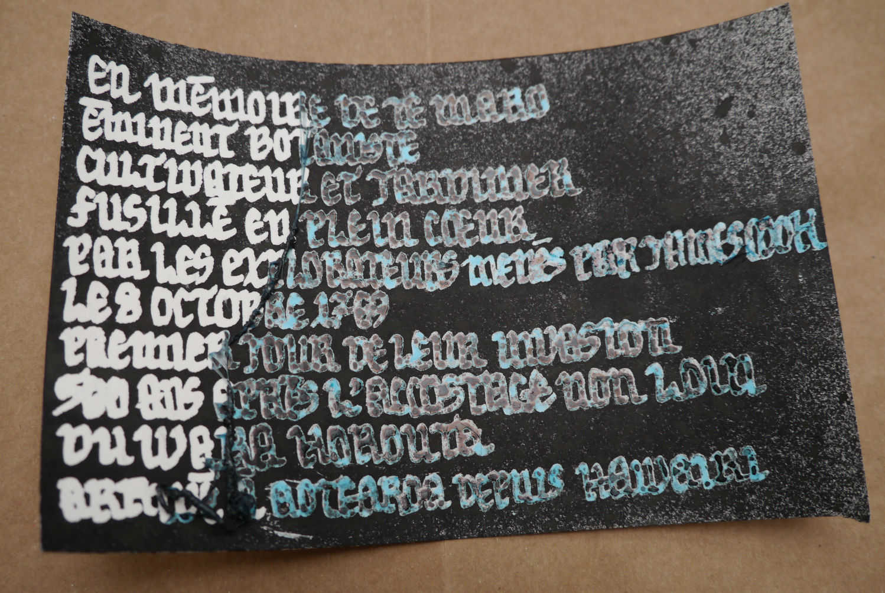

Le papier réservé peut être peint directement, ou laissé en blanc.

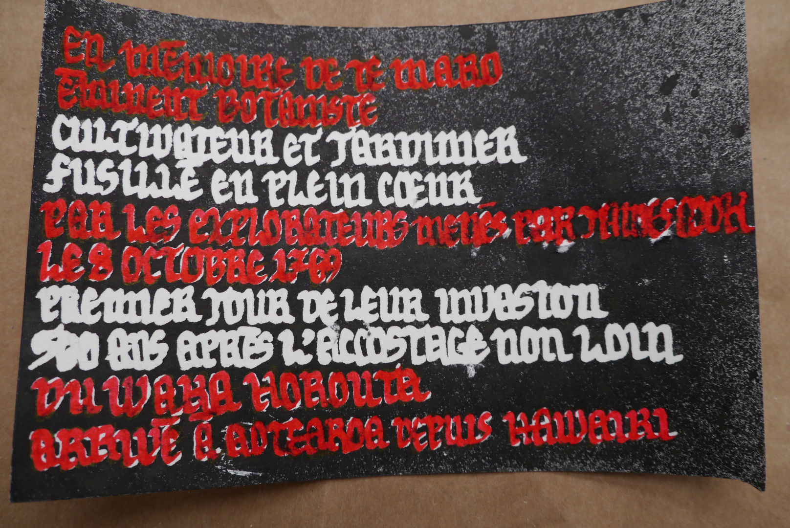

## Voyons

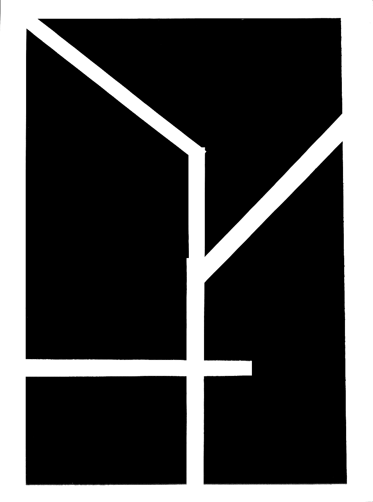

Dans le documentaire [Teaching to See][],
la graphiste [Inge Druckrey][]
nous présente quelques-uns des exercices
qu'elle donne à ses élèves pour leur « apprendre à voir ».

Dans un de ces exercices, elle donne aux élèves cinq lignes
à partir desquelles ils doivent créer une composition.
Au-delà de la forme dessinée par les lignes,
elle leur demande d'observer l'espace négatif,
la forme de l'espace vide dans le reste de la page.

Une autre composition figure l'opposition de deux carrés à choisir librement.
Ces deux formes basiques se confrontent dans une multitude de relations :
une distance, un rapport d'échelle, une orientation relative.
Elles développent un rapport dynamique avec le reste de la page.
Elles définissent une direction et un espace.
La verticale de la page leur donne un axe de gravité
qu'elles peuvent choisir de suivre ou de rejeter.

Ces exercices sont aussi l'occasion de découvrir,
à travers la diversité des compositions de chacun,
la variété infinie des créations possibles
à partir des mêmes éléments.

Teaching to See, documentaire de Andrei Severny produit par Edward Tufte  
https://teachingtosee.org

[Teaching to See]: https://teachingtosee.org
[Inge Druckrey]: https://en.wikipedia.org/wiki/Inge_Druckrey

## Livres d'images

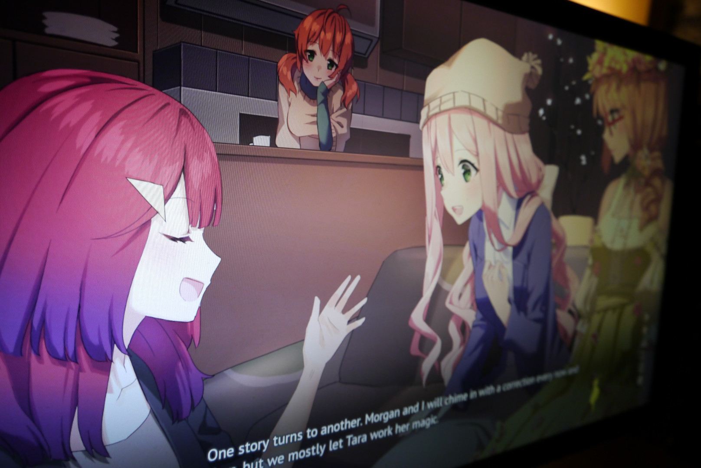

Comme son nom ne l'indique pas, le [« visual novel »][] trouve son origine
au Japon, dans les années 1980. Le roman visuel est une forme hybride
qui met la technologie des jeux vidéo au service de la narration du roman.
Il s'inspire à la fois des [jeux vidéo en mode texte][]
et des techniques d'[animation limitée][]
développées par [Hanna-Barbera][] pour la télévision dans les années 1950.
Cette esthétique naît des mêmes contraintes de temps et de budget :
les romans visuels sont développés à l'économie
par des équipes d'une dizaine de personnes,
de petite taille relativement à un jeu vidéo classique.
Le texte est omniprésent à l'écran, il expose l'histoire,
les sentiments des personnages, et de nombreux dialogues,
à la manière d'une pièce de théâtre. Les détails des lieux
et des actions passent également par le texte,
comme des didascalies, alors qu'à l'image les mêmes fonds
et les mêmes attitudes de personnages sont réutilisées autant que possible
pour illustrer des scènes qui varient pourtant dans le scénario.
Ils font toutefois la part belle à la musique,
avec des compositions travaillées
qui contribuent à l'ambiance des différentes scènes.

L'histoire est parfois très linéaire, comme un roman avec quelques choix
qui amèneraient à des fins alternatives, ce qui en fait un jeu vidéo
sans jeu et sans vidéo. Mais comme dans les meilleurs livres d'images,
le texte dialogue avec les illustrations et leur rencontre fait naître
de nouvelles émotions.

[« visual novel »]: https://fr.wikipedia.org/wiki/Visual_novel
[jeux vidéo en mode texte]: https://fr.wikipedia.org/wiki/Jeu_en_mode_texte
[animation limitée]: https://fr.wikipedia.org/wiki/Animation_limit%C3%A9e
[Hanna-Barbera]: https://fr.wikipedia.org/wiki/Hanna-Barbera_Productions

## Voix sans issue

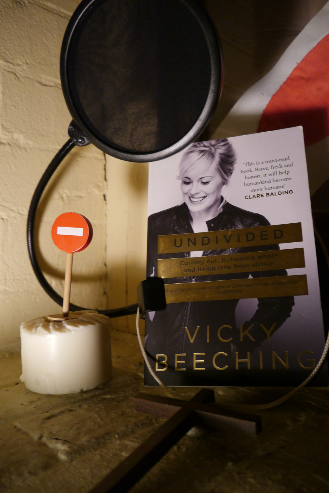

Le 14 août 2014, la carrière de la chanteuse de rock chrétien
[Vicky Beeching][] s'est arrêtée du jour au lendemain.
Tous ses concerts, tous ses contrats ont été annulés.
Les chorales d'églises qui chantaient la veille ses louanges
ont supprimé tous ses chants de leur répertoire.

Son crime, [c'est d'avoir parlé][].
De décrire ce mal qui la ronge de l'intérieur
depuis l'échec des tentatives d'exorcisme qui lui ont été infligées.
Victime convaincue d'être hantée par un démon, elle a été soumise
depuis l'enfance à une manipulation mentale insidieuse.
Frappée par une maladie auto-immune qui l'a forcée
à remettre en question les mensonges dont on l'avait persuadée,
sa santé fragile, après des mois de chimiothérapie,
lui laisse peu d'énergie pour se reconstruire.
Pourtant, elle continue de subir les attaques répétées
de croyants bien faire, justifiés par une Église
qui pardonne les bourreaux qu'elle héberge en son sein,
mais à qui il reste trop peu de compassion pour leurs victimes.

Cinquante ans après les [événements de Stonewall][],
J.C. reste le grand absent de la communauté LGBTQIA+
et la colombe de paix de Noé refuse toujours de voler
sous l'arc-en-ciel de la marche des fiertés.

Undivided, autobiographie de Vicky Beeching  
https://vickybeeching.com/book/

[Vicky Beeching]: https://vickybeeching.com
[c'est d'avoir parlé]: https://vickybeeching.com/lgbt/
[événements de Stonewall]: https://fr.wikipedia.org/wiki/%C3%89meutes_de_Stonewall

