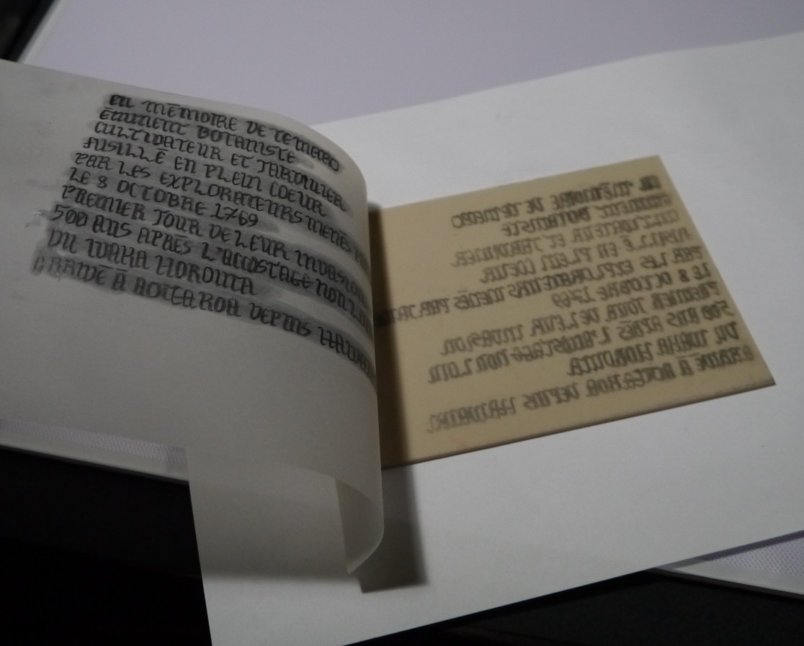

# Numéro 6

Semaine du 29 avril au 6 mai 2020

## Déformations professionnelles

Enseigner est un métier, ça ne s'improvise pas.
Avant d'enseigner, il faut apprendre à enseigner.

Apprendre non plus, ça ne s'improvise pas.
Aussi, avant d'apprendre, il faut apprendre à apprendre.

Mais qui va nous enseigner à apprendre à apprendre ?
Un enseignant sachant enseigner comment apprendre à apprendre.

Dans le cas de la formation à distance, il y a un problème.
L'enseignant n'est pas présent pour guider l'apprenant dans ses premiers pas.
Il doit donc réfléchir, de manière indirecte, à des interactions
qui permettront à l'apprenant de découvrir par lui-même
tout ce dont il a besoin pour progresser dans la formation.

C'est une analyse similaire à la création d'un jeu :
le créateur du jeu n'est pas présent avec les joueurs.
Il conçoit un système de règles
qui vont façonner de manière indirecte
l'expérience des joueurs au cours du jeu.
Même mieux, il existe aujourd'hui des jeux
auxquels on peut commencer à jouer sans lire les règles,
que l'on découvre progressivement en tirant des cartes
au fur et à mesure de la première partie.

## Le peintre réservé

## Voyons

## Livres d'images

## Voix sans issue

