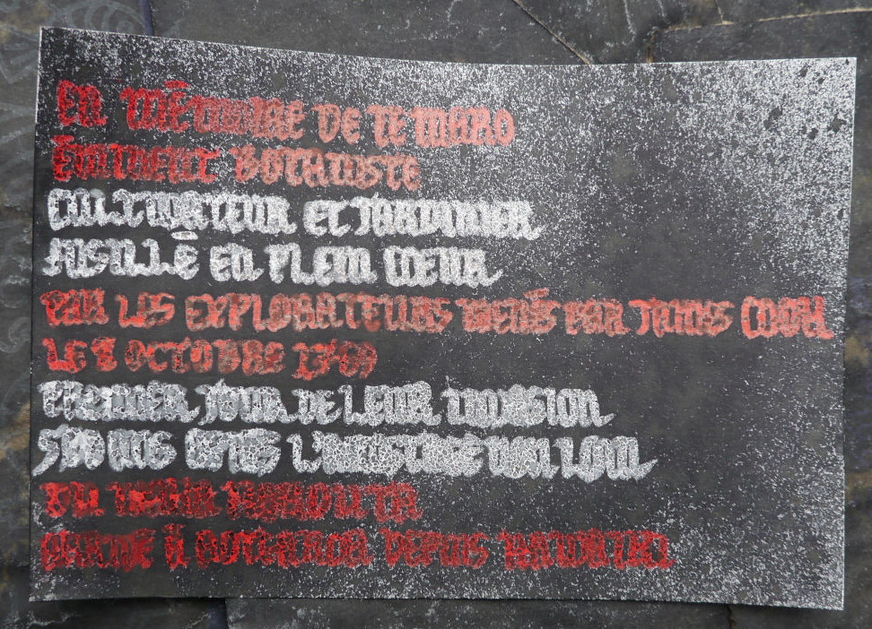

# Numéro 6

Semaine du 29 avril au 6 mai 2020

## Déformations professionnelles

Enseigner est un métier, ça ne s'improvise pas.
Avant d'enseigner, il faut apprendre à enseigner.

Apprendre non plus, ça ne s'improvise pas.
Aussi, avant d'apprendre, il faut apprendre à apprendre.

Mais qui va nous enseigner à apprendre à apprendre ?
Un enseignant sachant enseigner comment apprendre à apprendre.

Dans le cas de la formation à distance, il y a un problème.
L'enseignant n'est pas présent
pour tenir la main de l'élève qui fait ses premiers pas.
Il doit donc réfléchir, de manière indirecte, à des interactions
qui permettront à l'apprenant de découvrir par lui-même
tout ce dont il a besoin pour progresser dans la formation.

C'est une analyse similaire à la création d'un jeu :
le créateur du jeu n'est pas présent avec les joueurs.
Il conçoit un système de règles
qui vont façonner de manière indirecte
l'expérience des joueurs au cours du jeu.
Même mieux, il existe aujourd'hui des jeux
auxquels on peut commencer à jouer sans lire les règles,
que l'on découvre progressivement en tirant des cartes
au fur et à mesure de la première partie.

## Le peintre réservé

Lorsqu'on peint avec des encres liquides,
il est difficile de préserver de petits espaces blancs.
L'encre blanche coûte cher, et n'est souvent que d'un faible secours.
Les couleurs s'additionnent par transparence et se mélangent sur la feuille.
Ainsi, pour avoir du blanc, il faut garder la page vierge
ou bien n'y ajouter que du blanc, et rien d'autre.

Pour réserver ces espaces blancs pendant qu'on peint,
qu'on verse, qu'on pulvérise de l'encre à cœur joie,
voici la technique la plus rapide, la plus pratique
et celle qui donne les meilleurs résultats.
Malheureusement, il s'agit de trois méthodes différentes.

### Le pastel gras

C'est la technique la plus rapide.
Le pastel gras file sur la feuille
comme le beurre sur la poêle,
et recouvre rapidement la zone à protéger.

Après application, on peut peindre immédiatement sur toute la feuille.
Le gras du pastel repousse l'encre,
qui va coucher ailleurs.
C'est le même principe que la [lithographie][].

[lithographie]: https://fr.wikipedia.org/wiki/Lithographie#Principe

Avant d'utiliser la zone réservée, il faut bien la gommer
pour enlever le pastel. Sinon, l'encre est repoussée.

On peut ensuite peindre directement sur le papier préservé.
C'est comme si l'on avait fait un trou
dans la couche de peinture supérieure
pour arriver jusqu'au papier.

Malheureusement, le pastel n'est pas précis.
Il est difficile à tailler car il s'effrite en poussière.
Il est très fragile. Et il colle aux doigts.

### Les crayons pastel

C'est la technique la plus pratique. Les crayons pastel se taillent
et s'utilisent comme des crayons classiques. Ils sont très précis.

Malheureusement, en contrepartie, ils sont beaucoup moins couvrants
qu'un bâtonnet de pastel gras, et ils repoussent l'encre faiblement.

### Le fluide de masquage

C'est la technique la plus pénible, mais malheureusement
c'est celle qui donne les meilleurs résultats.

Le fluide de masquage est un liquide bleu à base de latex,
qui sèche à l'air libre pour former un film protecteur.
Il sent très mauvais, il est un peu toxique et irritant.
Son emploi requiert des précautions.

Il faut attendre 45 minutes pour qu'il sèche sur la feuille
avant de pouvoir peindre par-dessus. A l'inverse, il sèche rapidement
et s'accumule dans les poils des pinceaux et il est très difficile
de les récupérer.

Utilisé ici à la plume, on peut avoir un résultat assez précis.

J'ai utilisé un sèche-cheveux pendant quelques minutes
pour réduire le temps de séchage avant de peindre.

Il faut ensuite attendre que la peinture soit bien sèche
avant d'enlever le film protecteur. Appliqué en couche épaisse,
il se décolle facilement en frottant avec le doigt.
Mais il arrive parfois qu'il adhère un peu trop
et qu'il s'arrache en déchirant la feuille.

Le papier réservé peut être peint directement, ou laissé en blanc.

## Voyons

## Livres d'images

## Voix sans issue

