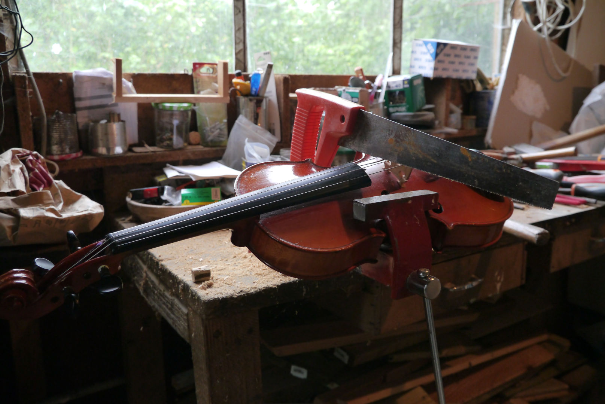
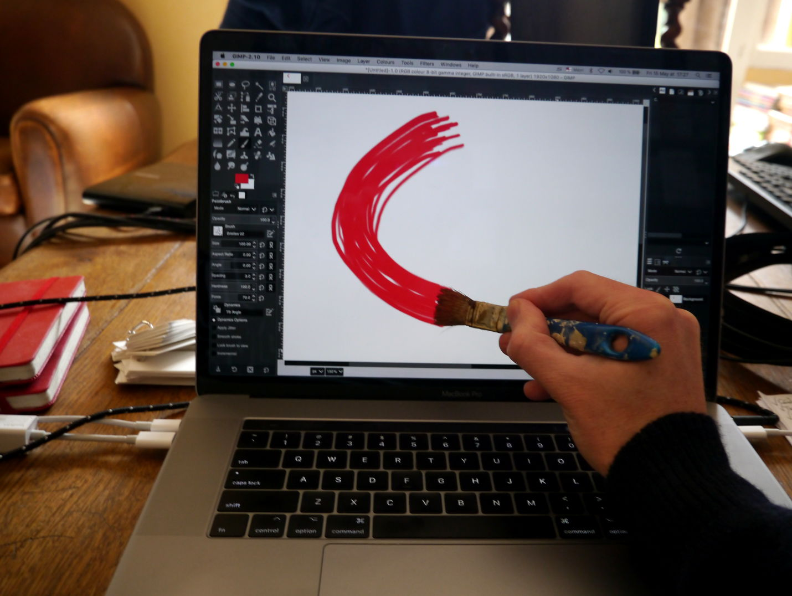
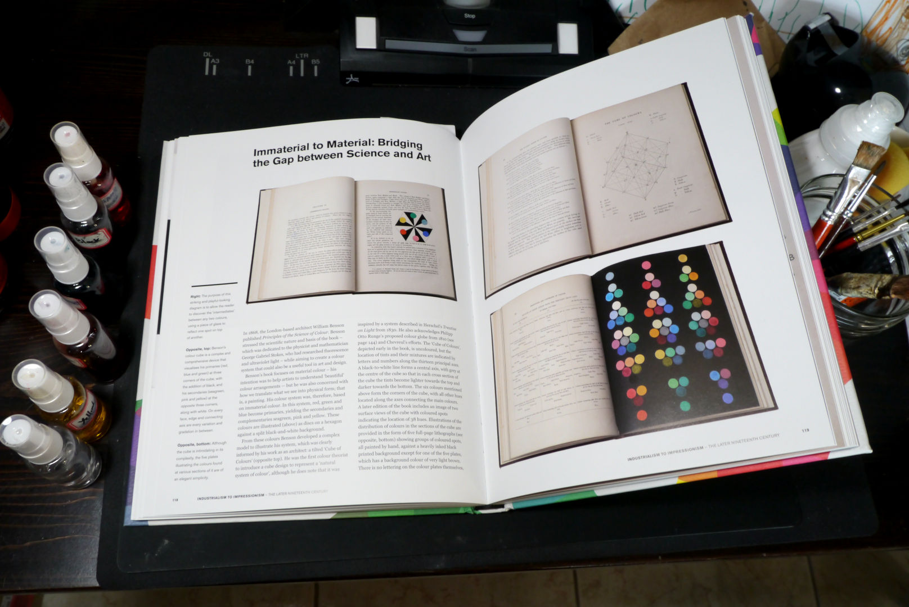
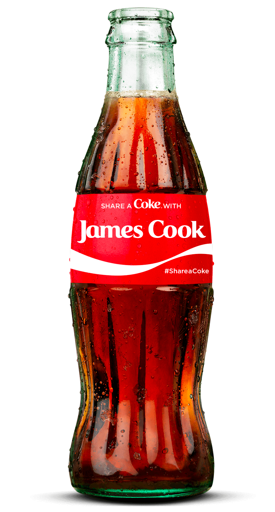

# Numéro 7

Semaine du 13 mai au 20 mai 2020

## Ghost Contact

Je marchais dans la rue, slalomant entre les passants
pour préserver les distances de sécurité,
quand j'ai fait l'expérience d'une présence fantomatique.
Une fragrance flotte dans l'air,
quelques notes d'une lotion ou d'un parfum laissées à l'abandon.
La personne n'est plus là,
mais reste présente dans ces traces qui persistent,
5 secondes, 10, combien de temps encore ?
Comme il devient difficile d'éviter le contact
s'il faut maintenant danser en quatre dimensions !

Ce concept de contact indirect est familier au Japon.
Il apparaît souvent dans l'intrigue des mangas et séries animées.
Si par mégarde, aveuglé par la soif d'un été brûlant,
un personnage boit à la bouteille déjà utilisée par un autre,
il y a là un baiser indirect,
ce qui peut être cause de trouble et de confusion,
quand on vit dans une société du « sans contact ».

## Thank You for the Music

Je me sens redevable à la radio [France Musique][]
qui m'a ouvert les portes de royaumes oubliés
et m'a offert des heures de sommeil supplémentaires
après un réveil trop matinal. Jour après jour,
même dans un demi-sommeil, j'ai commencé à apprécier
de nouvelles nuances dans la musique classique.
Les enregistrements vieillissent et s'usent à l'oreille,
mais la musique elle-même ne meurt jamais.
Elle se renouvelle sans cesse,
se réinvente, se refait une jeunesse.
On ne joue jamais deux fois le même morceau.
Un soliste dont l'interprétation est parfaite pour un enregistrement en studio
aura tendance à prendre plus de risques en concert, ce qui donnera une
nouvelle interprétation moins exacte mais plus vivante, plus énergique.
Chaque chef d'orchestre apporte sa vision de l'œuvre
qu'il enseigne et transmet à travers l'orchestre.
Mais on peut également changer la taille de l'orchestre,
et le choix des instruments, modernes ou anciens,
pour donner une nouvelle couleur.
Pour une cure de jouvence, faisons des échanges pour un nouvel arrangement :
remplaçons un quatuor à cordes par un quintet à vent,
une guitare par un piano,
un piano par une harpe,
une harpe par un clavecin,
les combinaisons sont infinies.
Et si cela ne suffisait pas,
on peut encore changer le programme.
La proximité des œuvres présentées ensemble
tisse des parallèles
lors d'un concert ou sur un album enregistré
et raconte une histoire toujours renouvelée.

[France Musique]: https://www.francemusique.fr/

## The Shape of Design

[« The Shape of Design »][SHAPE_OF_DESIGN] est une collection d'essais
du graphiste [Frank Chimero][], où il élabore des réflexions
sur les processus de la création sous toutes ses formes.
Nous le suivons sur sa route, dans un voyage qui part du Jazz,
emprunte les autoroutes des États-Unis,
puis visite la poésie japonaise, la cuisine moléculaire
et les fabricants de couteaux artisanaux,
avec un petit détour par la préhistoire.

Dans l'un de ces essais,
il interroge les peintres de la Renaissance
sur ce qu'ils peuvent nous apprendre
sur la création d'aujourd'hui.
Les maîtres gardent jalousement leurs secrets.
Mais l'observation de leurs autoportraits
révèle un mouvement de va-et-vient.
Comme dans une danse, le peintre s'approche du tableau pour peindre,
puis fait un pas en arrière pour l'observer, avant de recommencer.
Cette alternance de mouvements s'accompagne d'un changement de point de vue.
Collé la toile, le peintre réfléchit au Comment.
Un pas en arrière, il peut considérer le Pourquoi.

Assis devant l'écran de nos ordinateurs,
rappelons-nous de la danse des vieux maîtres
et n'oublions pas de faire un pas en arrière
pour gagner une nouvelle perspective.

[SHAPE_OF_DESIGN]: https://shapeofdesignbook.com/
[Frank Chimero]: https://frankchimero.com/about/

## Colour: a Visual History

Dans son livre, publié en français sous le titre
[« Couleur : une histoire visuelle »][COLOUR_FR],
Alexandra Loske nous offre un délice pour les yeux,
un beau-livre rempli d'images de beaux livres sur la couleur.

Dans le prolongement de sa thèse de doctorat,
ce livre  présente trois siècles d'évolution
des connaissances sur la couleur et de leur enseignement,
du traité d'optique publié par Isaac Newton en 1704
jusqu'aux éventails de couleurs vendus par Pantone aujourd'hui.

Le texte est divisé en courts chapitres, érudits mais pas ennuyeux,
qui sont l'occasion d'autant de belles rencontres avec les acteurs
illustres ou inconnus de l'histoire des couleurs.

[COLOUR_FR]: https://pyramyd-editions.com/collections/all/products/couleur-une-histoire-visuelle

## Coca-Colonisation

En 2019, Coca-Cola célébrait ses [100 ans de présence en France][COKEFR100].
Dans une [vidéo][COKEFR100_VIDEO] de propagande pour la marque,
la bouteille emblématique apparaît dans les mains et dans les cœurs
des français à travers les plus grands événements
des cinquantes dernières années, de la libération de Paris
à la victoire de l'équipe de France en coupe du monde de football
en passant par les barricades de mai 1968.

Pourtant, la distribution de Coca-Cola en France est assez récente,
et a été confrontée à une vive opposition.
Jusqu'à la deuxième guerre mondiale,
la marque est totalement inconnue en France,
seulement vendue aux américains expatriés.
C'est la grande époque du BYRRH,
et le marché des boissons sans alcool est inexistant.

Après la deuxième guerre mondiale,
la demande de mise sur le marché de Coca-Cola est ressentie
comme une volonté impérialiste des États-Unis
de supplanter la culture française et
de privilégier leur économie au détriment des produits locaux.
Les communistes montent au créneau
et refusent ce qu'ils appellent la [« Coca-Colonisation »][COCACOLONIZATION].
La license d'exploitation de Coca-Cola est refusée une première fois,
avant d'être [accordée seulement en 1952][COKEFRHISTORY].

[COCACOLONIZATION]: https://en.wikipedia.org/wiki/Cocacolonization
[COKEFRHISTORY]: https://uh.edu/engines/epi1985.htm

Le terme, lui est resté, et il s'applique au-delà du Coca-Cola
à la diffusion mondiale de tout un ensemble d'icônes
de la culture américaine : Disney, McDonald's, Starbucks, etc.

Pour prolonger l'anachronisme des 100 ans de Coca-Cola
vendu en France depuis 1952, je m'amuse à imaginer
que la Coca-Colonisation a commencé beaucoup plus tôt.
Ainsi, l'arrivée de l'anglais James Cook en Nouvelle-Zélande en 1769
peut être perçue comme le début d'une colonisation culturelle anglo-saxonne
aux dépens de la culture Māori.

[COKEFR100]: https://www.coca-cola-france.fr/histoire/les-evenements-les-plus-marquants-de-l-histoire-de-coca-cola/coca-cola-fete-ses-100-ans-en-france-l-histoire-du-siecle
[COKEFR100_VIDEO]: https://www.youtube.com/watch?v=ddnskVMsyEU

