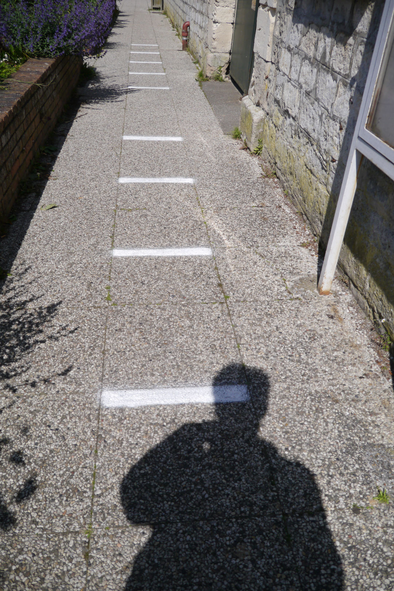

# Numéro 7

Semaine du 13 mai au 20 mai 2020

## Ghost Contact

Je marchais dans la rue, slalomant entre les passants
pour préserver les distances de sécurité,
quand j'ai fait l'expérience d'une présence fantomatique.
Une fragrance flotte dans l'air,
quelques notes d'une lotion ou d'un parfum laissées à l'abandon.
La personne n'est plus là,
mais reste présente dans ces traces qui persistent,
5 secondes, 10, combien de temps encore ?
Comme il devient difficile d'éviter le contact
s'il faut maintenant danser en quatre dimensions !

Ce concept de contact indirect est familier au Japon.
Il apparaît souvent dans l'intrigue des mangas et séries animées.
Si par mégarde, aveuglé par la soif d'un été brûlant,
un personnage boit à la bouteille utilisée par un autre,
il y a là un baiser indirect,
ce qui peut être cause de trouble et de confusion.

## Thank You for the Music

## The Shape of Design

## Colour: a Visual History

## Coca-colonization

